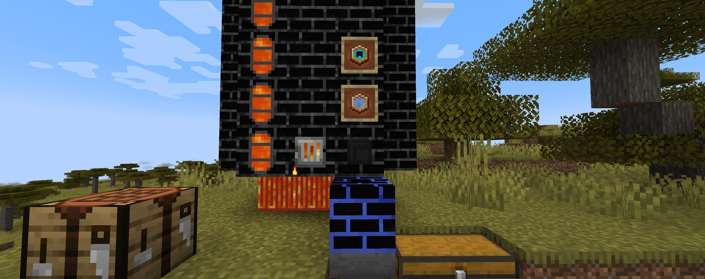
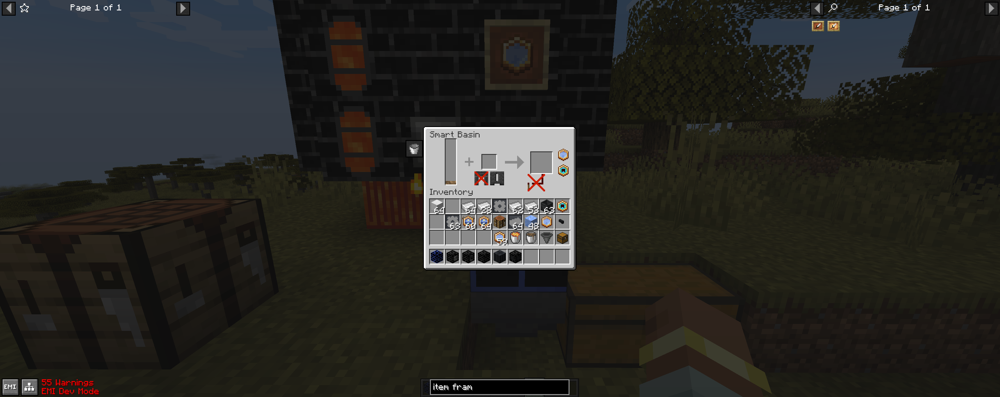

# Productive Tinker IO

A Productive Metalworks addon that adds stuffs inspired from Tinker I/O.

## Content

### Smart Basin (Smart Output)

Smart Output, or Smart Basin, can be used to casting the fluid metals into ingots, blocks, gears, etc, depends on what
casting mold is used.

### Basin Upgrade

Change the mode of Smart Basin to Basin Mode.

Any item with data component `productive_tinker_io:basin_upgrade` is considered as Basin Upgrade.

### Speed Upgrade

Reduce the recipe time of Smart Basin. Speed upgrades can be further enhanced by crafting with ices (ice, packed ice and
blue ices), which its bonus is slightly increased.

Any item with data component `productive_tinker_io:speed_upgrade` is considered as Speed Upgrade. (
`/give @p minecraft:stick[productive_tinker_io:speed_upgrade={recipeTimeFactor: 1.0}]`)

### More?

You can just ask for more features in issues.

## Credits

Thank gkbm2013 for creating the excellent [Tinker I/O](https://github.com/gkbm2013/tinker-IO).
