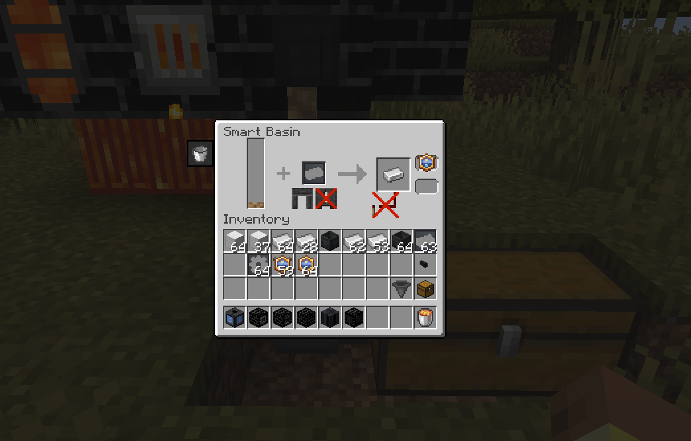
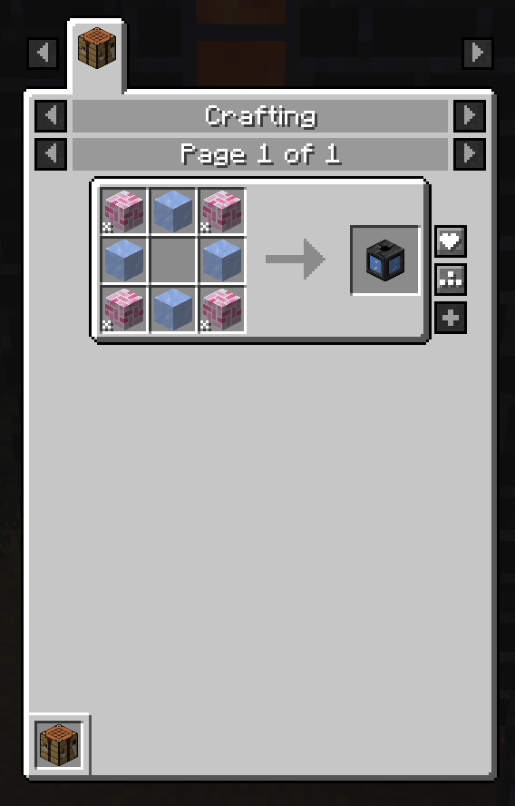

# Productive Tinker IO

A Productive Metalworks addon that adds stuffs inspired from Tinker I/O.

## Content

### Smart Basin (Smart Output)

The only ported content is the Smart Output, or Smart Basin in this version.

It can be used to casting the fluid metals into ingots, blocks, gears, etc, depends on what casting mold is used.

### Upgrades

The upgrades are not ported actually, I used the ProductiveLib ones for the same purpose.

It can accept tier 1 and 2 speed upgrade to accelerate the recipe by 20% and 70%. Only one upgrade will take effect.

And you can use Basin from ProductiveMetalworks as upgrades to activate the Basin mode of the Smart Basin.

The redstone upgrade is not ported, and I don't have a plan for it for now. You can open an issue to push this.

### More?

You can just ask for more features in issues.

## Credits

Thank gkbm2013 for creating the excellent [Tinker I/O](https://github.com/gkbm2013/tinker-IO).
